# NTNUx

更適合你的課程查詢系統

##### 物理114 薛皓陽

##### 物理114 林子敬

----

這份簡報

https://hackmd.io/@magical/NTNUx


---

## 專案發想

----

### 原版系統太難用

- 介面緩慢、不易操作
- 查詢緩慢、查詢條件不友好
- 行動裝置很難過

----

### 改善

- 現代化網頁框架
- 前端篩選
- 響應式網站設計

---

## 資料

----

爬，狠狠爬


----

- 瀏覽器控制：`selenium`
- 封包監聽：`mitmproxy`

----

格式化與整理

|          |  原始  | 格式化 | 拆分 |
|:--------:|:------:|:------:|:----:|
| 檔案大小 | 5~8 MB | 3~5 MB | 數個檔案<br/>最大~700KB     |

----

整理後

```json!
{
    "acadm_year":"113",
    "acadm_term":"2",
    "authorize_p":"4",
    "authorize_using":"3",
    "chn_name":"學習分析工具實務應用 </br>[ 學分學程：教育大數據微學程 ]",
    "classes":"",
    "comment":"陳俊豪",
    "counter":"37",
    "counter_exceptAuth":"34",
    "course_avg":"",
    "course_code":"05UG032",
    "course_group":"",
    "course_kind":"半",
    "credit":"3.0",
    "dept_chiabbr":"通識",
    "dept_code":"GU",
    "dept_group_name":"",
    "eng_name":"Learning Analytics Tools Implementation Applications </br>[ Program: The Program of Big Data in Education ]",
    "eng_teach":"",
    "form_s":"",
    "limit":"1",
    "limit_count_h":"35",
    "option_code":"通",
    "restrict":"",
    "rt":"N",
    "serial_no":"0967",
    "teacher":"陳俊豪",
    "time_inf":"四 8-10 和平 綜1001",
    "time_loc":{"四 8-10":"和平 綜1001"},
    "generalCore":["A4UG"]
}
```

---

## 網頁

<div style="flex-direction: row; display: flex">
    <div>
        <a href="https://ntnux.sun92122.com">ntnux.sun92122.com</a>
        
    </div>
    <div>
        <a href="https://ntnux2.sun92122.com">ntnux2.sun92122.com</a>
        
    </div>
</div>

----

### 網頁框架 － Nuxt.js

開源、免費、好吃（？


----

### UI 套件 － PrimeVue

按鈕、導覽列、資料表格、彈出視窗...

----

電腦（螢幕寬度～1528px）


----

手機（螢幕寬度 390px）


---

## 比較

----

## 比較
### 速度

----


| 可以開始查詢<br/>（含點擊至查詢頁面） | 查詢時間 |
|:--------------------------------:|:--------:|
|              ~ 2 秒              |  ~ 7 秒  |

----


| 可以開始查詢 | 查詢時間 |
|:------------:|:--------:|
|    ~ 2 秒    |  < 1 秒  |

----

## 比較
### 顯示資訊

----


----

## 比較
### 查詢方式

----


----


----

## 其他

----

有一點點用的首頁


----

簡易課表（beta）


----

暗色模式，防止手機變光劍


---

## 附錄

----

made by: [gitdiagram.com](https://gitdiagram.com/sun92122/ntnux)

```mermaid
flowchart TD
    %% Backend Layer
    subgraph "Backend ETL Pipeline"
        direction TB
        BackendETL["Backend ETL Pipeline"]:::backend
        Orchestrator["main.py"]:::backend
        Crawler["crawl/browser.py"]:::backend
        RawData[(Raw JSON Repository)]:::data
        Analysis["hook/analysis.py"]:::backend
        SaveHook["hook/save.py"]:::backend
        Tools["Utility Tools"]:::backend
        ToolMin["minimize.py"]:::backend
        ToolParse["parse.py"]:::backend
        ToolProxy["proxy.py"]:::backend
        ToolStrip["strip.py"]:::backend
        FinalData[(Processed JSON)]:::data
        Requirements["requirements.txt"]:::backend

        BackendETL --> Orchestrator
        Orchestrator --> Crawler
        Crawler --> RawData
        RawData --> Analysis
        Analysis --> SaveHook
        SaveHook --> Tools
        Tools --> ToolMin
        Tools --> ToolParse
        Tools --> ToolProxy
        Tools --> ToolStrip
        ToolMin --> FinalData
        ToolParse --> FinalData
        ToolProxy --> FinalData
        ToolStrip --> FinalData
        Orchestrator --> Requirements
    end

    %% Frontend Layer
    subgraph "Frontend / Presentation Layer"
        direction TB
        FrontendApp["Frontend Nuxt Application"]:::frontend
        NuxtConfig["nuxt.config.ts"]:::frontend
        Pages["pages/index.vue"]:::frontend
        Components["UI Components"]:::frontend
        Floating["FloatingSchedule.vue"]:::frontend
        CourseCell["courseCell.vue"]:::frontend
        ServerTS["server/tsconfig.json"]:::frontend
        Dependencies["package.json & lock, tsconfig.json"]:::frontend
        StaticJSON[(public/data Static JSON Store)]:::data
        BundledData[(output-data.json)]:::data
        NuxtServer["Nuxt Server"]:::frontend

        FrontendApp --> NuxtConfig
        FrontendApp --> Dependencies
        FrontendApp --> ServerTS
        FrontendApp --> Pages
        FrontendApp --> Components
        Components --> Floating
        Components --> CourseCell
        FrontendApp --> NuxtServer
        NuxtServer --> StaticJSON
        NuxtServer --> BundledData
    end

    %% Client
    Browser["Browser / Client"]:::external
    Browser -->|"HTTP Request"| NuxtServer
    Browser -->|"Fetch JSON"| StaticJSON
    Browser -->|"Fetch JSON"| BundledData
    Browser -->|"Render UI"| Pages
    Pages --> Floating
    Pages --> CourseCell

    %% Deployment Data Flow
    FinalData -->|"Deployed to"| StaticJSON
    FinalData -->|"Deployed to"| BundledData

    %% Click Events
    click BackendETL "https://github.com/sun92122/ntnux/tree/main/backend/"
    click Crawler "https://github.com/sun92122/ntnux/blob/main/backend/crawl/browser.py"
    click Analysis "https://github.com/sun92122/ntnux/blob/main/backend/hook/analysis.py"
    click SaveHook "https://github.com/sun92122/ntnux/blob/main/backend/hook/save.py"
    click ToolMin "https://github.com/sun92122/ntnux/blob/main/backend/tool/minimize.py"
    click ToolParse "https://github.com/sun92122/ntnux/blob/main/backend/tool/parse.py"
    click ToolProxy "https://github.com/sun92122/ntnux/blob/main/backend/tool/proxy.py"
    click ToolStrip "https://github.com/sun92122/ntnux/blob/main/backend/tool/strip.py"
    click RawData "https://github.com/sun92122/ntnux/tree/main/backend/original_data/"
    click Orchestrator "https://github.com/sun92122/ntnux/blob/main/backend/main.py"
    click Requirements "https://github.com/sun92122/ntnux/blob/main/backend/requirements.txt"
    click FrontendApp "https://github.com/sun92122/ntnux/tree/main/frontend/"
    click NuxtConfig "https://github.com/sun92122/ntnux/blob/main/frontend/nuxt.config.ts"
    click Pages "https://github.com/sun92122/ntnux/blob/main/frontend/pages/index.vue"
    click Floating "https://github.com/sun92122/ntnux/blob/main/frontend/components/FloatingSchedule.vue"
    click CourseCell "https://github.com/sun92122/ntnux/blob/main/frontend/components/courseCell.vue"
    click StaticJSON "https://github.com/sun92122/ntnux/tree/main/frontend/public/data/"
    click BundledData "https://github.com/sun92122/ntnux/blob/main/frontend/output-data.json"
    click Dependencies "https://github.com/sun92122/ntnux/blob/main/frontend/package.json"
    click ServerTS "https://github.com/sun92122/ntnux/blob/main/frontend/server/tsconfig.json"

    %% Styles
    classDef backend fill:#d0e7ff,stroke:#036,sroke-width:1px
    classDef frontend fill:#e0ffe0,stroke:#093,stroke-width:1px
    classDef data fill:#fff3cd,stroke:#993,stroke-width:1px
    classDef external fill:#f0f0f0,stroke:#666,stroke-width:1px
```



---

## 特別感謝

- Cloudflare 的便宜網域和免費 pages
- 問題本人 a.k.a. 國立臺灣師範大學
- 最大靈感來源 [臺大課程網](https://course.ntu.edu.tw/)