```mermaid
flowchart TD
    %% Backend Layer
    subgraph "Backend ETL Pipeline"
        direction TB
        BackendETL["Backend ETL Pipeline"]:::backend
        Orchestrator["main.py"]:::backend
        Crawler["crawl/browser.py"]:::backend
        RawData[(Raw JSON Repository)]:::data
        Analysis["hook/analysis.py"]:::backend
        SaveHook["hook/save.py"]:::backend
        Tools["Utility Tools"]:::backend
        ToolMin["minimize.py"]:::backend
        ToolParse["parse.py"]:::backend
        ToolProxy["proxy.py"]:::backend
        ToolStrip["strip.py"]:::backend
        FinalData[(Processed JSON)]:::data
        Requirements["requirements.txt"]:::backend

        BackendETL --> Orchestrator
        Orchestrator --> Crawler
        Crawler --> RawData
        RawData --> Analysis
        Analysis --> SaveHook
        SaveHook --> Tools
        Tools --> ToolMin
        Tools --> ToolParse
        Tools --> ToolProxy
        Tools --> ToolStrip
        ToolMin --> FinalData
        ToolParse --> FinalData
        ToolProxy --> FinalData
        ToolStrip --> FinalData
        Orchestrator --> Requirements
    end

    %% Frontend Layer
    subgraph "Frontend / Presentation Layer"
        direction TB
        FrontendApp["Frontend Nuxt Application"]:::frontend
        NuxtConfig["nuxt.config.ts"]:::frontend
        Pages["pages/index.vue"]:::frontend
        Components["UI Components"]:::frontend
        Floating["FloatingSchedule.vue"]:::frontend
        CourseCell["courseCell.vue"]:::frontend
        ServerTS["server/tsconfig.json"]:::frontend
        Dependencies["package.json & lock, tsconfig.json"]:::frontend
        StaticJSON[(public/data Static JSON Store)]:::data
        BundledData[(output-data.json)]:::data
        NuxtServer["Nuxt Server"]:::frontend

        FrontendApp --> NuxtConfig
        FrontendApp --> Dependencies
        FrontendApp --> ServerTS
        FrontendApp --> Pages
        FrontendApp --> Components
        Components --> Floating
        Components --> CourseCell
        FrontendApp --> NuxtServer
        NuxtServer --> StaticJSON
        NuxtServer --> BundledData
    end

    %% Client
    Browser["Browser / Client"]:::external
    Browser -->|"HTTP Request"| NuxtServer
    Browser -->|"Fetch JSON"| StaticJSON
    Browser -->|"Fetch JSON"| BundledData
    Browser -->|"Render UI"| Pages
    Pages --> Floating
    Pages --> CourseCell

    %% Deployment Data Flow
    FinalData -->|"Deployed to"| StaticJSON
    FinalData -->|"Deployed to"| BundledData

    %% Click Events
    click BackendETL "https://github.com/sun92122/ntnux/tree/main/backend/"
    click Crawler "https://github.com/sun92122/ntnux/blob/main/backend/crawl/browser.py"
    click Analysis "https://github.com/sun92122/ntnux/blob/main/backend/hook/analysis.py"
    click SaveHook "https://github.com/sun92122/ntnux/blob/main/backend/hook/save.py"
    click ToolMin "https://github.com/sun92122/ntnux/blob/main/backend/tool/minimize.py"
    click ToolParse "https://github.com/sun92122/ntnux/blob/main/backend/tool/parse.py"
    click ToolProxy "https://github.com/sun92122/ntnux/blob/main/backend/tool/proxy.py"
    click ToolStrip "https://github.com/sun92122/ntnux/blob/main/backend/tool/strip.py"
    click RawData "https://github.com/sun92122/ntnux/tree/main/backend/original_data/"
    click Orchestrator "https://github.com/sun92122/ntnux/blob/main/backend/main.py"
    click Requirements "https://github.com/sun92122/ntnux/blob/main/backend/requirements.txt"
    click FrontendApp "https://github.com/sun92122/ntnux/tree/main/frontend/"
    click NuxtConfig "https://github.com/sun92122/ntnux/blob/main/frontend/nuxt.config.ts"
    click Pages "https://github.com/sun92122/ntnux/blob/main/frontend/pages/index.vue"
    click Floating "https://github.com/sun92122/ntnux/blob/main/frontend/components/FloatingSchedule.vue"
    click CourseCell "https://github.com/sun92122/ntnux/blob/main/frontend/components/courseCell.vue"
    click StaticJSON "https://github.com/sun92122/ntnux/tree/main/frontend/public/data/"
    click BundledData "https://github.com/sun92122/ntnux/blob/main/frontend/output-data.json"
    click Dependencies "https://github.com/sun92122/ntnux/blob/main/frontend/package.json"
    click ServerTS "https://github.com/sun92122/ntnux/blob/main/frontend/server/tsconfig.json"

    %% Styles
    classDef backend fill:#d0e7ff,stroke:#036,sroke-width:1px
    classDef frontend fill:#e0ffe0,stroke:#093,stroke-width:1px
    classDef data fill:#fff3cd,stroke:#993,stroke-width:1px
    classDef external fill:#f0f0f0,stroke:#666,stroke-width:1px
```

---
type: slide
---

# NTNUx

更適合你的課程查詢系統

##### 物理114 薛皓陽

##### 物理114 林子敬

[](https://hackmd.io/91StSZb3QUmy9EJHnHtqLA)

Note:
大家早安，
今天為大家帶來

----

這份簡報

https://hackmd.io/@magical/NTNUx


Note:
首先，如果你想看這份簡報，
這裡有他的連結跟 QRcode

---

## 專案發想

Note:
關於這個專案，有個小故事，
2024/7/26，就是大約1年前，
當時我人在北捷上班，
看著課程查詢系統發呆，
想著，

----

### 原版系統太難用

- 介面緩慢、不易操作
- 查詢緩慢、查詢條件不友好
- 行動裝置很難過

Note:
這東西怎麼那麼難用啊，
按鈕小，手一抖就歪掉
搜尋選項一定要填，
手機別說搜尋了連瀏覽都有障礙

----

### 改善

- 現代化網頁框架
- 前端篩選
- 響應式網站設計

Note:
簡單來說，
要改的很單純，
好看、好用、快一點

---

## 資料

----

爬，狠狠爬


Note:
課程的資料部分，
期中有分享過，
搭配瀏覽器自動化和封包監聽，
可以輕鬆的用 python 把課程查詢系統的資料爬下來存

----

- 瀏覽器控制：`selenium`
- 封包監聽：`mitmproxy`

Note:
這是兩個比較重要的庫，
給有相關需求的人參考，
其他的都是 python 的標準庫，

----

格式化與整理

|               | 原始  | 稍微<br/>整理 | 格式化 |          拆分           |
|:-------------:| ----- |:-------------:|:------:|:-----------------------:|
| 檔案<br/>大小 | >9 MB |    5~8 MB     | 3~5 MB | 數個檔案<br/>最大~700KB |

Note:
爬下來的資料只能說相當可怕，
學校的資料中有很多是學生不知道也不需要的資訊，
格式也不適合一次性網路傳輸，
這裡就是在取得原始資料後做數次整理，
最後拆分成大約 10 個，
大小適合傳輸的 json 檔，
拆分的原因主要是善用 http 多路復用，
藉此加快從伺服器獲取資料

----

整理後

```json!
{
    "acadm_year":"113",
    "acadm_term":"2",
    "authorize_p":"4",
    "authorize_using":"3",
    "chn_name":"學習分析工具實務應用 </br>[ 學分學程：教育大數據微學程 ]",
    "classes":"",
    "comment":"陳俊豪",
    "counter":"37",
    "counter_exceptAuth":"34",
    "course_avg":"",
    "course_code":"05UG032",
    "course_group":"",
    "course_kind":"半",
    "credit":"3.0",
    "dept_chiabbr":"通識",
    "dept_code":"GU",
    "dept_group_name":"",
    "eng_name":"Learning Analytics Tools Implementation Applications </br>[ Program: The Program of Big Data in Education ]",
    "eng_teach":"",
    "form_s":"",
    "limit":"1",
    "limit_count_h":"35",
    "option_code":"通",
    "restrict":"",
    "rt":"N",
    "serial_no":"0967",
    "teacher":"陳俊豪",
    "time_inf":"四 8-10 和平 綜1001",
    "time_loc":{"四 8-10":"和平 綜1001"},
    "generalCore":["A4UG"]
}
```

---

## 網頁

<div style="flex-direction: row; display: flex">
    <div>
        <a href="https://ntnux.sun92122.com">ntnux.sun92122.com</a>
        
    </div>
    <div>
        <a href="https://ntnux2.sun92122.com">ntnux2.sun92122.com</a>
        
    </div>
</div>

Note:
那這是網站的部分，
理論上兩個只是部署方式不一樣應該不會差太多，
可以先掃起來玩，
避免覺得我講得太無聊
（等大家 5 秒）

----

### 網頁框架 － Nuxt.js

開源、免費、好吃（？


Note:
Nuxt 是基於 Vue.js 的 js 框架，
如果不知道 Vue 是甚麼 或是 框架是甚麼，
痾，可以問問 AI，他解釋的肯定比我好

----

### UI 套件 － PrimeVue

按鈕、導覽列、資料表格、彈出視窗...

Note:
UI 套件對現代網頁來講就是能用就用，
工程師還是儘量不要重複造輪子

----

電腦（螢幕寬度～1528px）


Note:
這個就是他大概的樣子，

----

手機（螢幕寬度 390px）


Note:
手機大概會長這樣，
這個比例應該接近 iPhone 12 pro，
那響應式網站通常會在意的是螢幕寬度，
因為現代人相對擅長往下滑、滾動，
所以會更需要注意怎麼把資訊塞進行動裝置的螢幕

---

## 比較

----

## 比較

### 速度

Note:
查詢速度，
對於像我一樣雙主修，
或是想把自己課表塞成高中生的同學，
原版的速度相信你肯定抱怨過

----


| 可以開始查詢<br/>（含點擊至查詢頁面） | 查詢時間 |
|:--------------------------------:|:--------:|
|              ~ 2 秒              |  ~ 7 秒  |

Note:
先來看看原版，
我們可以觀察到，
學校網站因為介面陽春，
出現到可以操作的時間並不會太久，
但缺點是查詢頁面不是一點進去就是，
更痛苦的絕對是查詢時間，
當然與查詢大小根伺服器快取有關，
這裡的大約 7 秒，是對於本學期通識搜尋，
算是比較大的搜尋條件

----


| 可以開始查詢 | 查詢時間 |
|:------------:|:--------:|
|    ~ 3 秒    |  < 1 秒  |

Note:
再來是我們的網站，
LCP，就是最大內容繪製大約需要 3 秒，
但之後只要在同一個學期，
所有操作都在瀏覽器內運作，
絕大多數搜尋操作都能在一秒內完成，
如果你剛剛掃左邊，網址裡沒有2的，會再更快一點，
感謝 cloudflare

----

## 比較

### 顯示資訊

----


Note:
資訊部分，
我們肯定希望他能涵蓋所有原版選課系統有的資訊
那目前，除了修課人數我還沒放上去，
你能在課程查詢看到的應該應該都能看的到

----

## 比較

### 查詢方式

----


Note:
查詢的部分，
這是你們熟悉的

----


Note:
這是你們不熟悉的，
這裡除了上課時間和學分學程的查詢我還寫好，
那 bug 那是肯定有，歡迎上 github 開 issue

----

## 其他

----

有一點點用的首頁


Note:
首頁的部分，
應該還會有多修改，
不過有鑑於大學四年，
我都是負責在群組提醒大家選課時間的，
希望他多少有一點幫助

----

簡易課表（beta）


----

- 暗色模式，防止手機變光劍
- 早八黃色標註
- ...

----

## {近期更新|`來不及做完`}

----

時間搜尋，把課表塞成高中生


Note:
時間搜尋是來自選課系統的查詢功能，
我一直不知道為什麼不放進課程查詢，
但總之我近期內會刻一個出來，
比較不一樣的是，
選課系統的查詢是只要有重疊就會出現，
不過比較合理的是，
課程時間要完全在你框選的時間範圍才應該呈現，
摁，我的之後會是這樣，敬請期待

----

- 更好看的課表、課表分享
- 更多篩選（歡迎許願）
- ...

Note:
能做的很多，
你需要的我不一定想的到，
歡迎大家有想要的功能都去丟 issue

---

## 附錄

----

made by: [gitdiagram.com](https://gitdiagram.com/sun92122/ntnux)



Note:
這是我用 AI 畫的，
我覺得蠻清楚呈現這個 Github 庫的架構，
有興趣可以看看

---

## 特別感謝

- Cloudflare 的便宜網域和免費 pages
- 問題本人 a.k.a. 國立臺灣師範大學
- 最大靈感來源 [臺大課程網](https://course.ntu.edu.tw/)

Note:
最後，照慣例，下學年課程會在 7/1 公布，
我可以承諾會持續維護這個專案大概兩年，
歡迎大家使用，
然後一階選課 7/29 - 8/1

---

## 感謝聆聽

---
type: slide
---

# NTNUx

更適合你的課程查詢系統

##### 物理114 薛皓陽

##### 物理114 林子敬

[](https://hackmd.io/91StSZb3QUmy9EJHnHtqLA)

Note:
大家早安，
今天為大家帶來

----

這份簡報

https://hackmd.io/@magical/NTNUx


Note:
首先，如果你想看這份簡報，
這裡有他的連結跟 QRcode

---

## 專案發想

Note:
關於這個專案，有個小故事，
2024/7/26，就是大約1年前，
當時我人在北捷上班，
看著課程查詢系統發呆，
想著，

----

### 原版系統太難用

- 介面緩慢、不易操作
- 查詢緩慢、查詢條件不友好
- 行動裝置很難過

Note:
這東西怎麼那麼難用啊，
按鈕小，手一抖就歪掉
搜尋選項一定要填，
手機別說搜尋了連瀏覽都有障礙

----

### 改善

- 現代化網頁框架
- 前端篩選
- 響應式網站設計

Note:
簡單來說，
要改的很單純，
好看、好用、快一點

---

## 資料

----

爬，狠狠爬


Note:
課程的資料部分，
期中有分享過，
搭配瀏覽器自動化和封包監聽，
可以輕鬆的用 python 把課程查詢系統的資料爬下來存

----

- 瀏覽器控制：`selenium`
- 封包監聽：`mitmproxy`

Note:
這是兩個比較重要的庫，
給有相關需求的人參考，
其他的都是 python 的標準庫，

----

格式化與整理

|               | 原始  | 稍微<br/>整理 | 格式化 |          拆分           |
|:-------------:| ----- |:-------------:|:------:|:-----------------------:|
| 檔案<br/>大小 | >9 MB |    5~8 MB     | 3~5 MB | 數個檔案<br/>最大~700KB |

Note:
爬下來的資料只能說相當可怕，
學校的資料中有很多是學生不知道也不需要的資訊，
格式也不適合一次性網路傳輸，
這裡就是在取得原始資料後做數次整理，
最後拆分成大約 10 個，
大小適合傳輸的 json 檔，
拆分的原因主要是善用 http 多路復用，
藉此加快從伺服器獲取資料

----

整理後

```json!
{
    "acadm_year":"113",
    "acadm_term":"2",
    "authorize_p":"4",
    "authorize_using":"3",
    "chn_name":"學習分析工具實務應用 </br>[ 學分學程：教育大數據微學程 ]",
    "classes":"",
    "comment":"陳俊豪",
    "counter":"37",
    "counter_exceptAuth":"34",
    "course_avg":"",
    "course_code":"05UG032",
    "course_group":"",
    "course_kind":"半",
    "credit":"3.0",
    "dept_chiabbr":"通識",
    "dept_code":"GU",
    "dept_group_name":"",
    "eng_name":"Learning Analytics Tools Implementation Applications </br>[ Program: The Program of Big Data in Education ]",
    "eng_teach":"",
    "form_s":"",
    "limit":"1",
    "limit_count_h":"35",
    "option_code":"通",
    "restrict":"",
    "rt":"N",
    "serial_no":"0967",
    "teacher":"陳俊豪",
    "time_inf":"四 8-10 和平 綜1001",
    "time_loc":{"四 8-10":"和平 綜1001"},
    "generalCore":["A4UG"]
}
```

---

## 網頁

<div style="flex-direction: row; display: flex">
    <div>
        <a href="https://ntnux.sun92122.com">ntnux.sun92122.com</a>
        
    </div>
    <div>
        <a href="https://ntnux2.sun92122.com">ntnux2.sun92122.com</a>
        
    </div>
</div>

Note:
那這是網站的部分，
理論上兩個只是部署方式不一樣應該不會差太多，
可以先掃起來玩，
避免覺得我講得太無聊
（等大家 5 秒）

----

### 網頁框架 － Nuxt.js

開源、免費、好吃（？


Note:
Nuxt 是基於 Vue.js 的 js 框架，
如果不知道 Vue 是甚麼 或是 框架是甚麼，
痾，可以問問 AI，他解釋的肯定比我好

----

### UI 套件 － PrimeVue

按鈕、導覽列、資料表格、彈出視窗...

Note:
UI 套件對現代網頁來講就是能用就用，
工程師還是儘量不要重複造輪子

----

電腦（螢幕寬度～1528px）


Note:
這個就是他大概的樣子，

----

手機（螢幕寬度 390px）


Note:
手機大概會長這樣，
這個比例應該接近 iPhone 12 pro，
那響應式網站通常會在意的是螢幕寬度，
因為現代人相對擅長往下滑、滾動，
所以會更需要注意怎麼把資訊塞進行動裝置的螢幕

---

## 比較

----

## 比較

### 速度

Note:
查詢速度，
對於像我一樣雙主修，
或是想把自己課表塞成高中生的同學，
原版的速度相信你肯定抱怨過

----


| 可以開始查詢<br/>（含點擊至查詢頁面） | 查詢時間 |
|:--------------------------------:|:--------:|
|              ~ 2 秒              |  ~ 7 秒  |

Note:
先來看看原版，
我們可以觀察到，
學校網站因為介面陽春，
出現到可以操作的時間並不會太久，
但缺點是查詢頁面不是一點進去就是，
更痛苦的絕對是查詢時間，
當然與查詢大小根伺服器快取有關，
這裡的大約 7 秒，是對於本學期通識搜尋，
算是比較大的搜尋條件

----


| 可以開始查詢 | 查詢時間 |
|:------------:|:--------:|
|    ~ 3 秒    |  < 1 秒  |

Note:
再來是我們的網站，
LCP，就是最大內容繪製大約需要 3 秒，
但之後只要在同一個學期，
所有操作都在瀏覽器內運作，
絕大多數搜尋操作都能在一秒內完成，
如果你剛剛掃左邊，網址裡沒有2的，會再更快一點，
感謝 cloudflare

----

## 比較

### 顯示資訊

----


Note:
資訊部分，
我們肯定希望他能涵蓋所有原版選課系統有的資訊
那目前，除了修課人數我還沒放上去，
你能在課程查詢看到的應該應該都能看的到

----

## 比較

### 查詢方式

----


Note:
查詢的部分，
這是你們熟悉的

----


Note:
這是你們不熟悉的，
這裡除了上課時間和學分學程的查詢我還寫好，
那 bug 那是肯定有，歡迎上 github 開 issue

----

## 其他

----

有一點點用的首頁


Note:
首頁的部分，
應該還會有多修改，
不過有鑑於大學四年，
我都是負責在群組提醒大家選課時間的，
希望他多少有一點幫助

----

簡易課表（beta）


----

- 暗色模式，防止手機變光劍
- 早八黃色標註
- ...

----

## {近期更新|`來不及做完`}

----

時間搜尋，把課表塞成高中生


Note:
時間搜尋是來自選課系統的查詢功能，
我一直不知道為什麼不放進課程查詢，
但總之我近期內會刻一個出來，
比較不一樣的是，
選課系統的查詢是只要有重疊就會出現，
不過比較合理的是，
課程時間要完全在你框選的時間範圍才應該呈現，
摁，我的之後會是這樣，敬請期待

----

- 更好看的課表、課表分享
- 更多篩選（歡迎許願）
- ...

Note:
能做的很多，
你需要的我不一定想的到，
歡迎大家有想要的功能都去丟 issue

---

## 附錄

----

made by: [gitdiagram.com](https://gitdiagram.com/sun92122/ntnux)


Note:
這是我用 AI 畫的，
我覺得蠻清楚呈現這個 Github 庫的架構，
有興趣可以看看

---

## 特別感謝

- Cloudflare 的便宜網域和免費 pages
- 問題本人 a.k.a. 國立臺灣師範大學
- 最大靈感來源 [臺大課程網](https://course.ntu.edu.tw/)

Note:
最後，照慣例，下學年課程會在 7/1 公布，
我可以承諾會持續維護這個專案大概兩年，
歡迎大家使用，
然後一階選課 7/29 - 8/1

---

## 感謝聆聽

